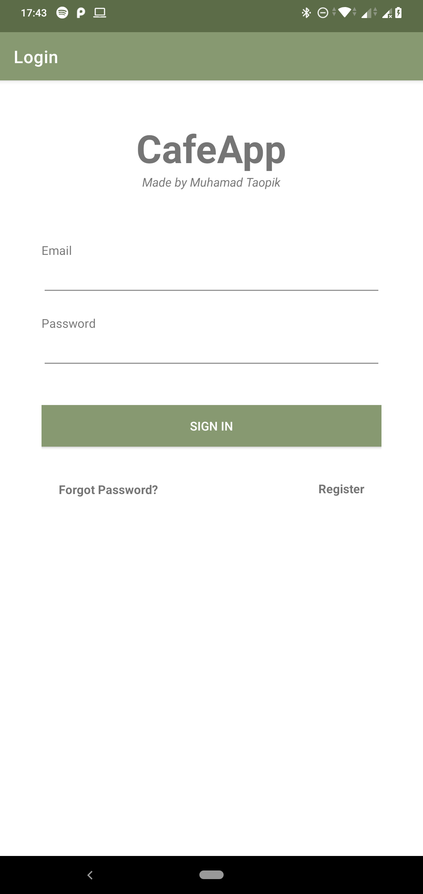
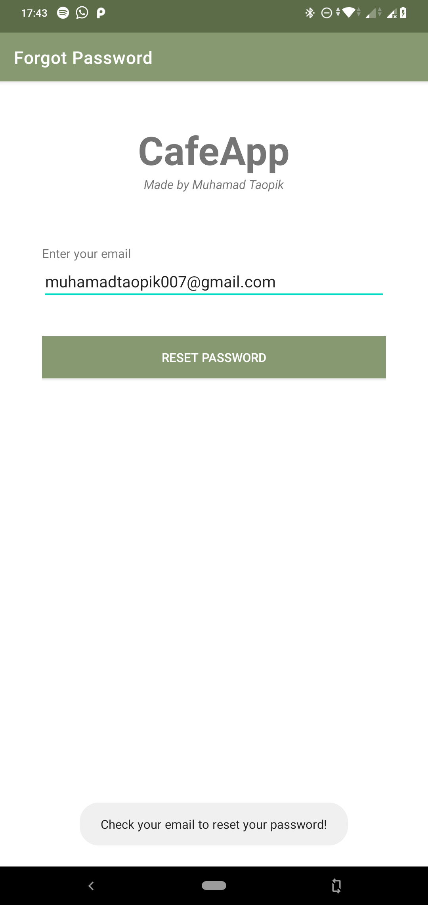
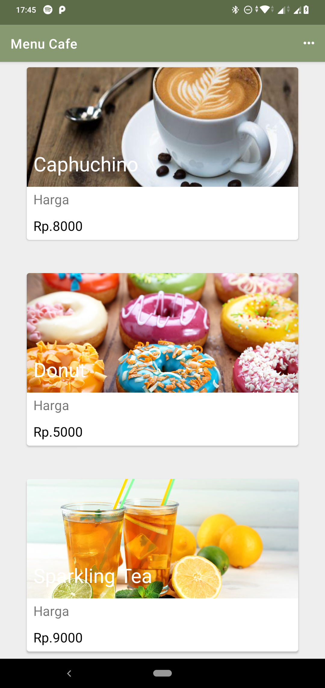
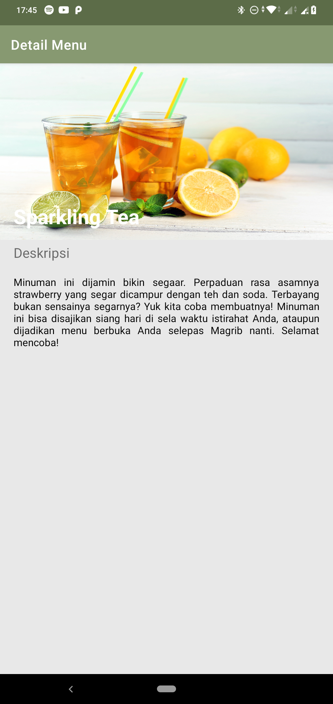

# CafeApp With SQLite


Untuk memenuhi syarat salah satu tugas `ujian akhir semester` mata kuliah **Praktikum Pengembangan Aplikasi Mobile**.

# Download Application

- Klik [CafeApp v.2.0](https://raw.githubusercontent.com/Mr94t3z/CafeApp-With-SQLite/master/application/CafeApp%20v2.0.apk) untuk `mengunduh` aplikasi.

# Results


Berikut merupakan `screenshot` hasil dari aplikasinya.

<h4>1. Login Layout</h4>




<h4>2. Register Layout</h4>


<h4>3. Forgot Password Layout</h4>




<h4>4. Menu Cafe</h4>




<h4>5. Detail Menu</h4>




<h4>6. Logout</h4>


# Last But Not Least

```
Build : run!
```
